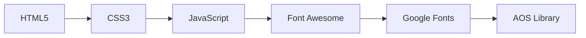
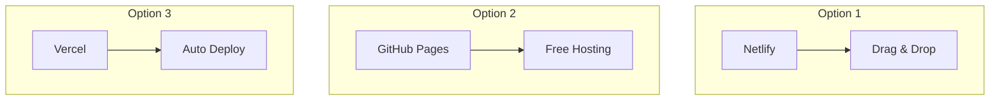

<div align="center">

<!-- Animated Header -->


<!-- Animated Typing -->
<a href="https://git.io/typing-svg"></a>

<!-- Badges Row 1 -->
<p>
  
  
  
  
</p>

<!-- Badges Row 2 -->
<p>
  
  
  
  
</p>

<!-- Status Badges -->
<p>
  
  
  
  
  
</p>

<!-- Quick Links -->
<p>
  <a href="https://imaginative-dusk-9f95ff.netlify.app/#home">
    
  </a>
  <a href="https://github.com/Kyubey-kub/Web-Portfolio">
    
  </a>
  <a href="mailto:somprasongwasuwid@gmail.com">
    
  </a>
</p>

</div>

---

<!-- Navigation -->
<details open>
<summary><h2>📑 Table of Contents</h2></summary>

| Section | Description |
|---------|-------------|
| [🎯 Overview](#-overview) | Project introduction and goals |
| [✨ Features](#-features) | Complete feature breakdown |
| [🎬 Demo](#-demo) | Live demo and screenshots |
| [🛠 Tech Stack](#-technologies-used) | Technologies and tools used |
| [🚀 Getting Started](#-getting-started) | Installation and setup guide |
| [📁 Project Structure](#-project-structure) | Codebase organization |
| [🎨 Customization](#-customization-guide) | How to personalize your portfolio |
| [🚢 Deployment](#-deployment) | Deployment instructions |
| [🌐 Browser Support](#-browser-support) | Supported browsers |
| [🤝 Contributing](#-contributing) | How to contribute |
| [👤 Author](#-author) | About the developer |

</details>

---

## 🎯 Overview

<div align="center">
  
</div>

**Web Portfolio** is a beautifully crafted **personal portfolio website** designed to help professionals showcase their skills, projects, and achievements in an elegant and impactful way. Whether you're a developer, designer, photographer, or creative professional, this template provides everything you need to create a **stunning online presence**.

### 💡 Why Choose This Portfolio?

<table>
<tr>
<td width="50%">

#### 🎨 For Users
- 🖼️ **Stunning Visuals** - Eye-catching design that impresses
- 🔍 **Easy Navigation** - Smooth scrolling & intuitive layout
- 📱 **Mobile-First** - Perfect on any device
- ⚡ **Lightning Fast** - Optimized for performance

</td>
<td width="50%">

#### 🔧 For Developers
- 🏗️ **Clean Codebase** - Well-organized & maintainable
- 🎨 **Easy Customization** - Quick to personalize
- 🔒 **Best Practices** - SEO & accessibility built-in
- 🚀 **Easy Deployment** - Ready for Netlify/Vercel

</td>
</tr>
</table>

<div align="center">
  
</div>

---

## ✨ Features

<div align="center">

### 🎨 Design Features

</div>

<table>
<tr>
<td width="33%" align="center">

### 🌐 Responsive


Mobile-first design that adapts perfectly to all screen sizes

</td>
<td width="33%" align="center">

### 🎭 Animations


Smooth scroll animations using **AOS** for enhanced UX

</td>
<td width="33%" align="center">

### 🎨 Modern UI


Clean, minimalistic design with focus on content

</td>
</tr>
<tr>
<td width="33%" align="center">

### 🌙 Theme Ready


Easy to add dark/light theme toggle

</td>
<td width="33%" align="center">

### 📱 Cross-Platform


Works seamlessly across all browsers

</td>
<td width="33%" align="center">

### ⚡ Fast Loading


Optimized assets for lightning-fast performance

</td>
</tr>
</table>

<div align="center">

### 📑 Sections Included

</div>

<table>
<tr>
<td width="50%">

| Section | Description |
|---------|-------------|
| 🏠 **Hero Section** | Eye-catching intro with name & tagline |
| 👤 **About Me** | Professional bio & introduction |
| 💼 **Skills** | Visual progress bars for abilities |
| 🖼️ **Portfolio** | Project showcase with images |
| 📋 **Experience** | Professional timeline |

</td>
<td width="50%">

| Section | Description |
|---------|-------------|
| 🛠️ **Services** | What you offer to clients |
| ⭐ **Testimonials** | Client reviews & recommendations |
| 📧 **Contact Form** | Easy way for visitors to reach you |
| 🔗 **Social Links** | Connect on various platforms |
| 📄 **Footer** | Copyright & additional info |

</td>
</tr>
</table>

<div align="center">

### ⚡ Interactive Elements


</div>

---

## 🎬 Demo

<div align="center">

### 🌐 Live Application

<a href="https://imaginative-dusk-9f95ff.netlify.app/#home">
  
</a>

</div>

### 📸 Screenshots Gallery

<details>
<summary><b>🏠 Home & Hero Section</b> (Click to expand)</summary>
<br/>

| Hero Section | Navigation |
|:------------:|:----------:|
|  |  |

</details>

<details>
<summary><b>👤 About & Skills</b> (Click to expand)</summary>
<br/>

| About Me | Skills |
|:--------:|:------:|
|  |  |

</details>

<details>
<summary><b>🖼️ Portfolio & Projects</b> (Click to expand)</summary>
<br/>

| Portfolio Grid | Project Details |
|:--------------:|:---------------:|
|  |  |

</details>

<details>
<summary><b>📧 Contact & Footer</b> (Click to expand)</summary>
<br/>

| Contact Form | Footer |
|:------------:|:------:|
|  |  |

</details>

---

## 🛠 Technologies Used

<div align="center">

### 🎨 Core Technologies

</div>



| Technology | Purpose | Links |
|:----------:|:--------|:-----:|
|  | Structure & Semantics | [Docs](https://developer.mozilla.org/en-US/docs/Web/HTML) |
|  | Styling & Animations | [Docs](https://developer.mozilla.org/en-US/docs/Web/CSS) |
|  | Interactivity & Logic | [Docs](https://developer.mozilla.org/en-US/docs/Web/JavaScript) |
|  | Icon Library | [Docs](https://fontawesome.com/) |
|  | Typography | [Docs](https://fonts.google.com/) |
|  | Scroll Animations | [Docs](https://michalsnik.github.io/aos/) |

<div align="center">

### 🛠️ Development & Deployment

</div>

| Tool | Purpose |
|:----:|:--------|
|  | Code Editor |
|  | Version Control |
|  | Deployment Platform |
|  | Testing & Debugging |

---

## 🚀 Getting Started

### 📋 Prerequisites

<table>
<tr>
<td>

```bash
# Required software
✅ Modern Web Browser
✅ Code Editor (VS Code)
✅ Git (optional)
✅ Basic HTML/CSS/JS knowledge
```

</td>
<td>

| Software | Download Link |
|----------|---------------|
| VS Code | [code.visualstudio.com](https://code.visualstudio.com/) |
| Git | [git-scm.com](https://git-scm.com/) |
| Chrome | [google.com/chrome](https://www.google.com/chrome/) |

</td>
</tr>
</table>

### 📥 Installation

<details open>
<summary><b>Step 1: Clone Repository</b></summary>

```bash
# Clone the repository
git clone https://github.com/Kyubey-kub/Web-Portfolio.git

# Navigate to the project directory
cd Web-Portfolio

# Open in your code editor
code .
```

</details>

<details>
<summary><b>Step 2: Run Locally</b></summary>

**Option 1: VS Code Live Server (Recommended)**
```bash
1. Install "Live Server" extension in VS Code
2. Right-click on index.html
3. Select "Open with Live Server"
```

**Option 2: Python HTTP Server**
```bash
# Python 3
python -m http.server 8000

# Then visit http://localhost:8000
```

**Option 3: Direct Open**
```bash
# Simply double-click index.html
# ⚠️ Some features may not work
```

</details>

<details>
<summary><b>Step 3: Customize & Deploy</b></summary>

```bash
# 1. Edit content in index.html
# 2. Modify styles in css/style.css
# 3. Update scripts in js/main.js
# 4. Replace images in images/ folder
# 5. Deploy to Netlify/Vercel/GitHub Pages
```

</details>

---

## 📁 Project Structure

<details>
<summary><b>📂 Click to view full project structure</b></summary>

```
📦 Web-Portfolio
│
├── 📄 index.html                 # Main HTML file
│
├── 📂 css/
│   ├── style.css                # Main stylesheet
│   ├── responsive.css           # Media queries
│   └── animations.css           # Animation styles
│
├── 📂 js/
│   ├── main.js                  # Main JavaScript
│   ├── animations.js            # Animation scripts
│   └── form-handler.js          # Contact form logic
│
├── 📂 images/
│   ├── 📂 profile/              # Profile pictures
│   ├── 📂 projects/             # Project screenshots
│   ├── 📂 skills/               # Skill icons
│   └── 📂 background/           # Background images
│
├── 📂 assets/
│   ├── 📂 fonts/                # Custom fonts
│   ├── 📂 icons/                # Icon files
│   └── 📂 documents/            # Resume/CV PDF
│
├── 📂 lib/                      # External libraries
│   ├── fontawesome/
│   ├── aos/
│   └── typed/
│
├── 📄 .gitignore                # Git ignore file
├── 📄 README.md                 # Documentation
└── 📄 LICENSE                   # MIT License
```

</details>

---

## 🎨 Customization Guide

### 1. Personal Information

**Edit `index.html`:**

```html
<!-- Hero Section -->
<h1>Your Name</h1>
<p>Your Professional Title</p>

<!-- About Section -->
<p>Your bio and description...</p>
```

### 2. Colors & Theme

**Edit `css/style.css`:**

```css
:root {
  /* Primary Colors */
  --primary-color: #667eea;
  --secondary-color: #764ba2;
  
  /* Background Colors */
  --bg-color: #ffffff;
  --section-bg: #f8f9fa;
  
  /* Text Colors */
  --text-primary: #2d3748;
  --text-secondary: #718096;
}
```

### 3. Adding Projects

```html
<div class="project-card">
  
  <h3>Project Title</h3>
  <p>Description...</p>
  <div class="project-links">
    <a href="#">Live Demo</a>
    <a href="#">GitHub</a>
  </div>
</div>
```

### 4. Social Links

```html
<div class="social-links">
  <a href="https://github.com/username"><i class="fab fa-github"></i></a>
  <a href="https://linkedin.com/in/profile"><i class="fab fa-linkedin"></i></a>
  <a href="https://twitter.com/handle"><i class="fab fa-twitter"></i></a>
</div>
```

---

## 🚢 Deployment

<div align="center">

### Deployment Options



</div>

### 🌐 Deploy to Netlify (Recommended)

<details open>
<summary><b>Drag & Drop Method</b></summary>

```bash
1. Go to netlify.com
2. Sign up / Log in
3. Drag your project folder to deploy zone
4. Your site is live! 🎉
```

</details>

### 📂 Deploy to GitHub Pages

<details>
<summary><b>GitHub Pages Setup</b></summary>

```bash
# Create gh-pages branch
git checkout -b gh-pages

# Push to GitHub
git push origin gh-pages

# Enable in repo Settings > Pages
```

**Your site:** `https://username.github.io/Web-Portfolio`

</details>

### ⚡ Deploy to Vercel

<details>
<summary><b>Vercel CLI</b></summary>

```bash
# Install Vercel CLI
npm install -g vercel

# Deploy
vercel

# Follow prompts
```

</details>

### 💰 Cost Estimation

| Platform | Cost | Features |
|:--------:|:----:|:---------|
| Netlify Free | $0/mo | Custom domain, SSL, 100GB bandwidth |
| GitHub Pages | $0/mo | Free hosting, custom domain |
| Vercel Free | $0/mo | Serverless, auto deploy |

---

## 🌐 Browser Support

| Browser | Version | Support |
|:-------:|:-------:|:-------:|
|  | Latest | ✅ Full |
|  | Latest | ✅ Full |
|  | Latest | ✅ Full |
|  | Latest | ✅ Full |
|  | Latest | ✅ Full |
|  | 11 | ❌ None |

---

## 📱 Responsive Breakpoints

```css
/* Mobile devices */
@media (max-width: 576px) { }

/* Tablets */
@media (max-width: 768px) { }

/* Small laptops */
@media (max-width: 992px) { }

/* Large screens */
@media (max-width: 1200px) { }
```

---

## 🤝 Contributing

<div align="center">

We welcome contributions! 🎉

</div>

```bash
# 1. Fork & Clone
git clone https://github.com/YOUR_USERNAME/Web-Portfolio.git

# 2. Create Branch
git checkout -b feature/AmazingFeature

# 3. Make Changes & Commit
git commit -m 'feat: Add AmazingFeature'

# 4. Push & Create PR
git push origin feature/AmazingFeature
```

### Commit Message Convention

| Type | Description |
|:----:|:------------|
| `feat` | New feature |
| `fix` | Bug fix |
| `docs` | Documentation |
| `style` | Code style |
| `refactor` | Code refactoring |

---

## 📝 Roadmap

- [ ] 🌙 Add dark/light theme toggle
- [ ] 📝 Add blog section
- [ ] 🎬 More animation effects
- [ ] 🌍 Multi-language support
- [ ] ♿ Accessibility improvements
- [ ] 📊 Add visitor analytics
- [ ] 🎥 Video portfolio section

---

## 📄 License

This project is licensed under the **MIT License** - see the [LICENSE](LICENSE) file for details.

---

## 👤 Author

<div align="center">


### **Somprasong Wasuwid**
*Full Stack Developer*

<p>
  <a href="https://github.com/Kyubey-kub">
    
  </a>
  <a href="https://www.linkedin.com/in/somprasong-wasuwid-271b64350/">
    
  </a>
  <a href="https://imaginative-dusk-9f95ff.netlify.app/#home">
    
  </a>
  <a href="mailto:somprasongwasuwid@gmail.com">
    
  </a>
</p>

</div>

---

## 🙏 Acknowledgments

<div align="center">

| Resource | Purpose |
|:--------:|:--------|
|  | Deployment |
|  | Icons |
|  | Typography |
|  | Animations |
|  | Free Images |

</div>

---

<div align="center">


**⭐ If you found this project helpful, please give it a star!**

**💖 Thank you for visiting!**

Made with ❤️ by [Kyubey-kub](https://github.com/Kyubey-kub)

**Last Updated:** February 2026

<a href="#top">
  
</a>

</div>
